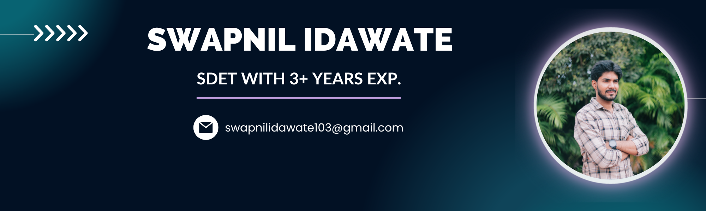

<h3 align="center">Hi there, I'm <a href="https://www.linkedin.com/in/swapnil-idawate-vidhate-025270151/" target="_blank" rel="noreferrer">Swapnil</a> 👋</h3>
<h2 align="center">I'm a Software Development Engineer in Test (SDET) with 3+ Years of Exp.💻, Avid Gamer 👨‍💻, and Passionate Fitness freak 🏋️‍♂️</h2>

## Skills

<h3 align="left">Languages and Tools:</h3>

         

## 📈 GitHub Stats 

&nbsp;

