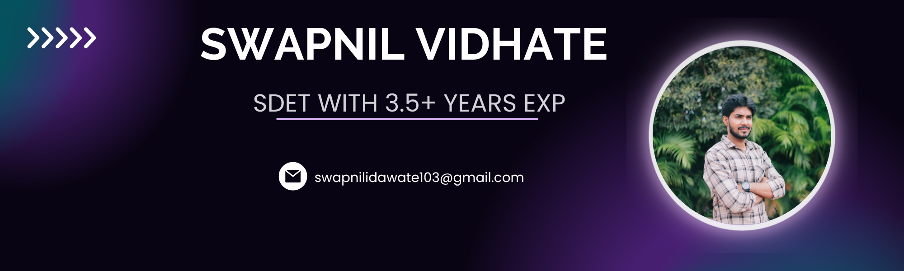

<h3 align="center">Hi there, I'm <a href="https://www.linkedin.com/in/swapnil-idawate-vidhate-025270151/" target="_blank" rel="noreferrer">Swapnil</a> 👋</h3>
<h2 align="center">I'm a Software Development Engineer in Test (SDET) with 3+ Years of Exp.💻, Avid Gamer 👨‍💻, and Passionate Fitness freak 🏋️‍♂️</h2>

## 🔭 I'm currently working on

- Microservices Testing Automation Framework
- Working on Creating a Single Automation Framework that will be able to run UI/API/Mobile Automated Tests Automatically. 
- Postman Newman Automated Test 

## 🌱 I'm currently learning

- I am currently exploring the worlds of Cloud especially AWS Services that can be used to improve the Automation Testing Process for products. 

## Skills

<h3 align="left">Languages and Tools:</h3>

  

  
  
  
  
  
  
  
  
  
  
  

## 📈 GitHub Stats 

&nbsp;

